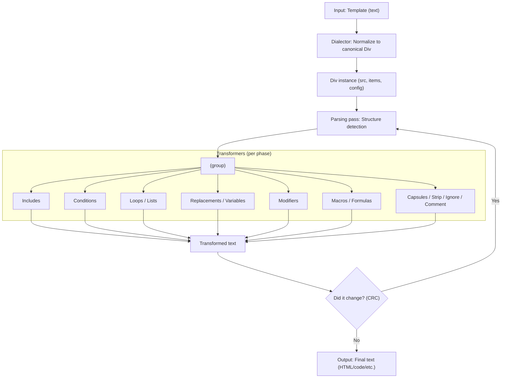
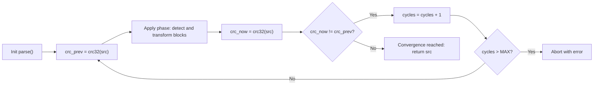
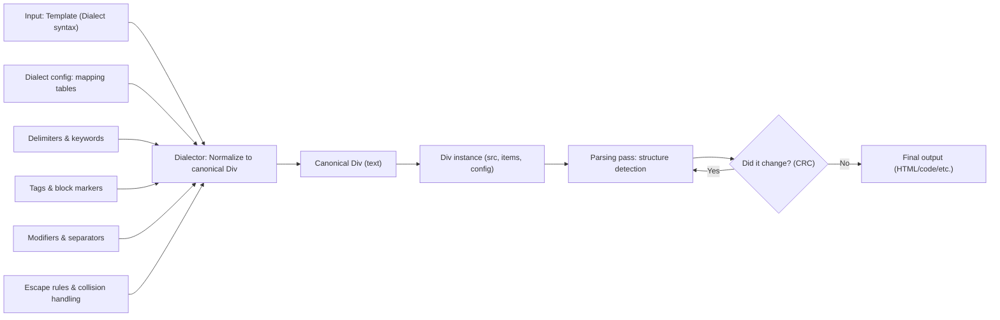
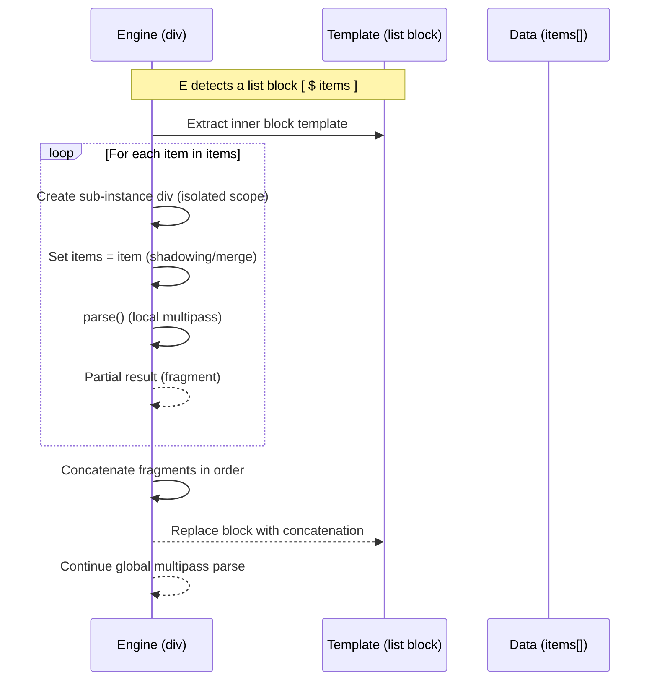
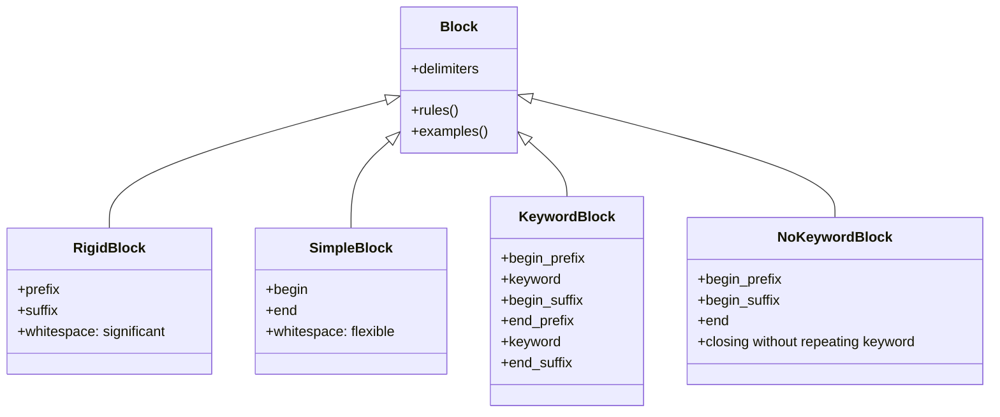

> [!WARNING]
> This documentation is currently under active construction.  
> Content may be incomplete, subject to change, or restructured as the Div engine evolves.  
> Please use with caution and check back regularly for updates.

**div** is a [template engine](https://en.wikipedia.org/wiki/Template_processor) and [code generator tool](https://en.wikipedia.org/wiki/Code_generation_%28compiler%29) tool written in [PHP](http://php.net/) and developed since 2011, designed to optimize collaboration between developers and designers through generative programming, model-driven architecture, and meta-programming. This engine not only facilitates the separation of labor between roles but also allows for deep customization through the creation of tailored template [dialects](https://dialector.divengine.org) to meet specific project needs.



One of the most distinctive features of **div** is its ability to **recursively process templates until there is no more code to process**, effectively avoiding infinite loops and enabling complex, multi-step transformations. This translates into exceptional flexibility for dynamically generating content or code based on the data and logic specified in the templates.



Additionally, **div** supports the creation of custom template dialects, allowing users to define and modify the syntax to better suit different programming environments or to enhance code readability and maintenance. For example, it's possible to configure a dialect that ensures templates remain as valid XML, facilitating integration with other systems and technologies that utilize XML.



## Scopes and sub-instances (loop render parallel/serial)



This engine is the cornerstone of [Divengine Software Solutions](https://divengine.com) and adheres to the philosophy of *"build more with less"* and *"divide the problem, not the people."* **div** proposes code generation based on templates that adhere to clear rules: the model contains all information about what is to be accomplished; the templates define the expected outcomes; and the engine, acting as a black box, takes care of the execution.

Basic operations include:

- **Compile**: Combine a template with models and save the result.
- **Transform**: Convert one model to another, reusing the compile operation.
- **Compose**: Integrate different results using the engine and other tools.



With **div**, developers and designers can avoid repetitive tasks, scale projects based on models, migrate projects to different technologies, and expand applications to other platforms and devices, all while improving application performance and enabling non-technical people to participate in the project's development.

## Install

```bash
composer require divengine/div
```
## Upgrade

```bash
composer upgrade
```

[](https://github.com/anuraghazra/github-readme-stats)

[[Introduction to Div PHP Template Engine]]
[[The div class]]
[[The best practices]]
[[Template Engine Features]]
[[Method's reference]]
[[Mechanisms]]
[[Appendixes]]

Se also the [[CHANGELOG]] and the [[FUTURE]] or this project.


#templates
