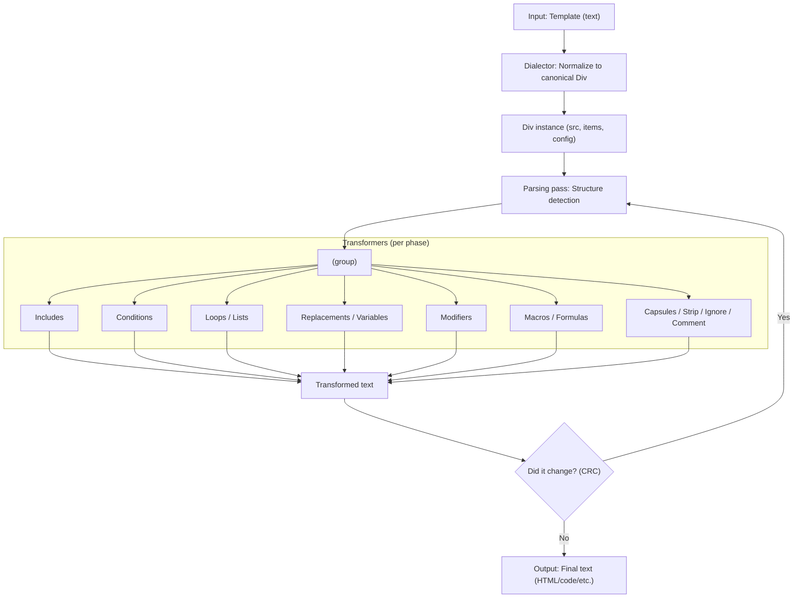
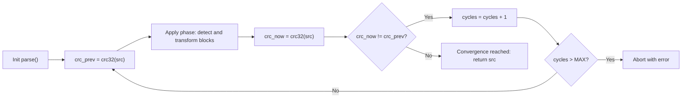
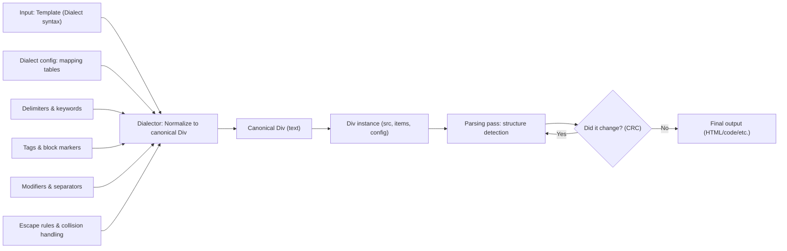
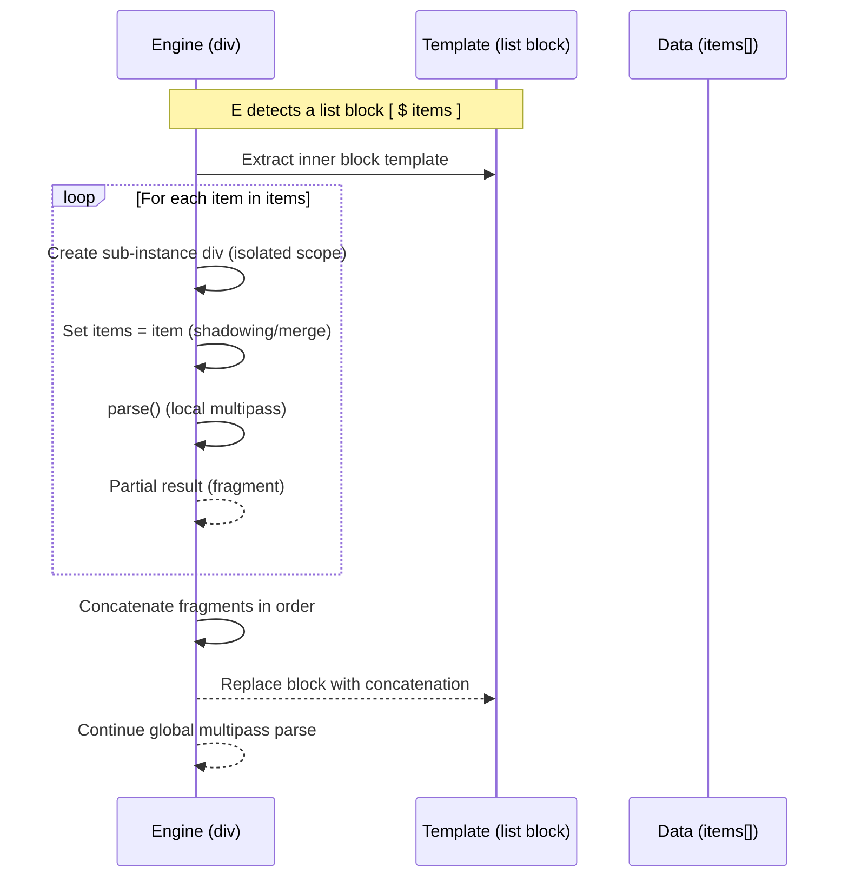

> [!WARNING]
> This documentation is currently under active construction.  
> Content may be incomplete, subject to change, or restructured as the Div engine evolves.  
> Please use with caution and check back regularly for updates.

# Overview

Requirements: PHP >= 8.0.

Div is a template engine and code generator written in PHP. It is designed to separate presentation concerns from data and behavior, and to support model-driven and generative workflows. The engine can adapt its syntax through dialects while preserving a canonical internal representation for parsing and transformation.

## Processing pipeline



## Convergence and recursion



## Dialects



## Loop scope and sub-instances



## Core operations

- Compile: combine a template with a model and save the result.
- Transform: convert one model into another by reusing compilation.
- Compose: assemble multiple outputs into a final artifact.

## Installation

```bash
composer require divengine/div
```

## Upgrade

```bash
composer upgrade
```

## Documentation map

- [[01 Introduction]]
- [[02 Template Features]]
- [[03 PHP Features]]
- [[04 Mechanisms]]
- [[05 Appendixes]]

See also [Release notes](../releases/README.md).

#templates
